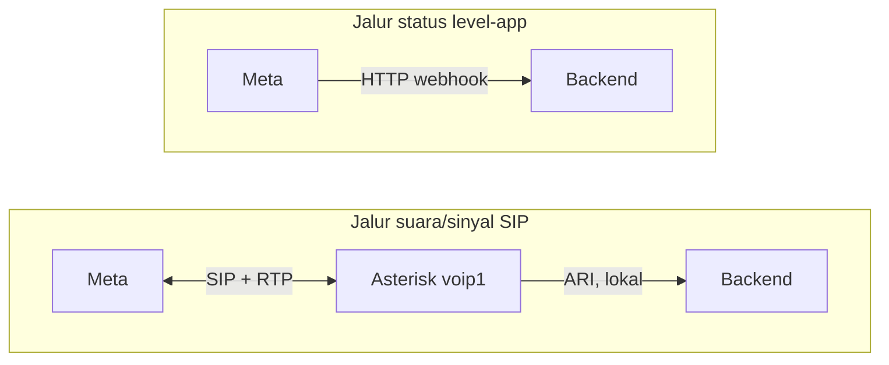
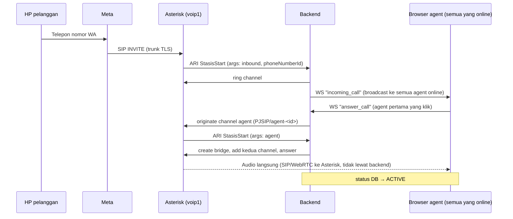
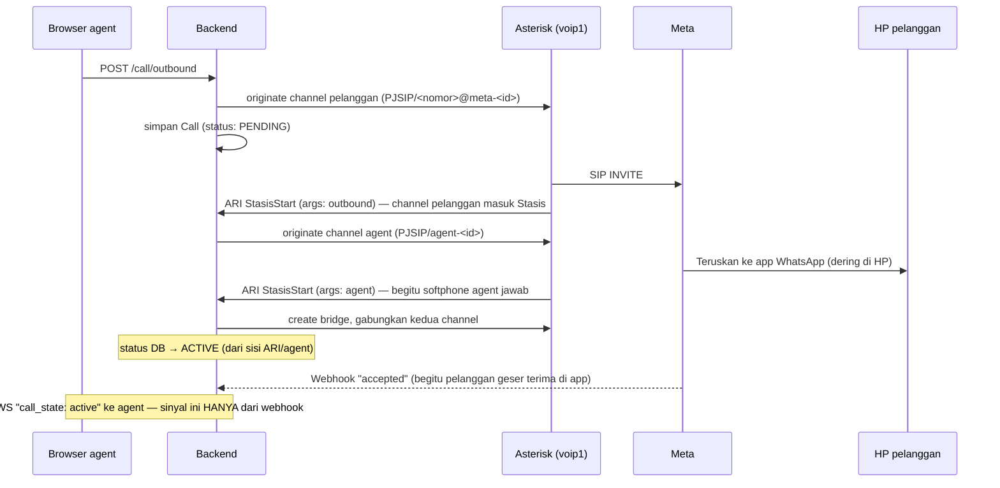

# 📞 Alur Panggilan (Call Flow)

Dokumen ini menjelaskan **apa yang sebenarnya terjadi**, langkah demi langkah, saat sebuah panggilan WhatsApp masuk atau keluar diproses oleh NusaCall — dari sinyal pertama sampai baris `calls` selesai ditulis ke database. Semua klaim di sini ditelusuri langsung dari kode yang berjalan, bukan asumsi.

---

## 1. Komponen yang Terlibat

| Komponen | Peran |
|---|---|
| **Meta** (`wa.meta.vc`) | Pemilik nomor WhatsApp. Menerima/meneruskan panggilan lewat SIP, dan melaporkan status level-aplikasi (ringing/accepted/rejected) lewat webhook. |
| **Asterisk** (voip1) | PBX kita sendiri. Trunk SIP ke Meta, dan transport WebSocket (SIP.js) ke browser agent. Satu-satunya titik yang menyentuh audio/RTP. |
| **Backend (NusaCall)** | Control plane murni — tidak pernah menangani media. Mengendalikan Asterisk lewat **ARI**, menerima notifikasi Meta lewat **webhook**, dan bicara ke browser agent lewat **WebSocket sinyal** miliknya sendiri. |
| **Browser agent** | Softphone berbasis SIP.js, bicara SIP-over-WebSocket langsung ke Asterisk untuk audio, dan WebSocket terpisah ke backend untuk sinyal UI (siapa nelpon, tombol angkat, dst). |

**Prinsip inti**: backend **tidak pernah** menyentuh SIP atau RTP secara langsung. Backend hanya memerintah Asterisk lewat ARI (REST API + event WebSocket internal) dan bereaksi terhadap eventnya.

---

## 2. Dua Jalur Sinyal yang Terpisah

Ini sumber kebingungan paling umum, jadi ditegaskan di awal:



- **Jalur SIP**: menangani sinyal panggilan yang murni terjadi di trunk (dering, angkat, tutup) — dipakai penuh untuk **panggilan masuk**, dan sebagian untuk **panggilan keluar** (trunk-level saja).
- **Jalur webhook**: menangani status yang terjadi **di dalam aplikasi WhatsApp** si pelanggan (dering di HP-nya, dia geser terima/tolak) — ini kejadian di sisi Meta yang **tidak otomatis** tercermin sebagai respons SIP di trunk kita, jadi Meta melaporkannya terpisah lewat webhook. **Hanya dipakai untuk panggilan keluar.**

Kenapa asimetris? Karena titik "penerjemahan" panggilan ke level-aplikasi WhatsApp beda posisinya:
- **Masuk**: Meta sudah menerjemahkan niat pelanggan jadi SIP INVITE *sebelum* sampai ke kita — begitu tiba, semuanya sudah murni SIP, kita yang kendalikan ring/answer sendiri.
- **Keluar**: kita kirim SIP INVITE ke Meta, tapi Meta masih harus menerjemahkannya jadi notifikasi di app WhatsApp pelanggan — proses itu di luar trunk SIP kita, jadi hasilnya dilaporkan lewat webhook.

---

## 3. Alur Panggilan Masuk



Langkah detail (rujukan: [asterisk-call-handler.service.ts](../src/modules/call/asterisk-call-handler.service.ts), [call-signaling.service.ts](../src/modules/call/call-signaling.service.ts)):

1. **Meta → Asterisk**: SIP INVITE masuk ke trunk `meta-<phoneNumberId>`, diarahkan dialplan ke `Stasis(nusacall-sip, inbound, <phoneNumberId>)`.
2. **`handleInboundStart`**: backend cari `Account` berdasarkan `phoneNumberId`, cari/buat `Contact` dari nomor penelepon, buat baris `Call` baru (`status: PENDING`), kirim `ringChannel()` ke Asterisk (dering terdengar di HP penelepon), lalu panggil `notifyIncoming()`.
3. **`notifyIncoming` → routing**: `RoutingService.decide()` **broadcast ke semua agent yang sedang online** (tidak ada logika penugasan per-nomor/departemen — lihat [routing.service.ts](../src/modules/routing/routing.service.ts)). Kalau tidak ada agent online sama sekali, panggilan langsung ditolak (`status: MISSED`, `endReason: NO_AGENT_AVAILABLE`).
4. **Race antar-agent**: begitu satu agent klik "angkat", WS mengirim `answer_call` → `handleAnswer()`. Fungsi ini pakai **rank guard** (`CALL_STATUS_RANK`) — siapa yang lebih dulu berhasil transisi status ke `CONNECTING` yang menang; agent lain yang telat dapat paket `call_taken`.
5. **`connectAgent`**: backend originate channel baru `PJSIP/agent-<userId>` ke Asterisk, masuk Stasis dengan `args: agent`.
6. **`handleAgentStart`**: begitu channel agent masuk Stasis (softphone browser-nya menjawab), backend bikin **bridge**, masukkan channel pelanggan + agent, `answerChannel()`, mulai rekaman kalau aktif, dan set status `ACTIVE`.
7. Dari titik ini audio mengalir **langsung** Asterisk ↔ browser agent (SIP.js/WebRTC) dan Asterisk ↔ Meta (SIP/TLS) — backend sudah tidak terlibat sampai panggilan berakhir.
8. **Timeout**: kalau tidak ada agent yang jawab dalam `CALL_ANSWER_TIMEOUT` detik, `expireIfStillRinging` otomatis set `MISSED` / `ANSWER_TIMEOUT`.

---

## 4. Alur Panggilan Keluar



Langkah detail:

1. **`initiateOutbound`** ([call-signaling.service.ts](../src/modules/call/call-signaling.service.ts)): backend originate channel pelanggan ke Asterisk (`PJSIP/<nomor-E.164>@meta-<phoneNumberId>`), simpan baris `Call` (`direction: OUTBOUND`, `status: PENDING`, `userId` = agent yang menelepon).
2. **`handleOutboundCustomerStart`**: begitu channel pelanggan masuk Stasis (Asterisk sudah mulai dial ke trunk Meta — **belum tentu sudah dijawab**), backend langsung originate channel agent lewat `connectAgent()`.
3. **`handleAgentStart`**: begitu channel **agent** (bukan pelanggan) masuk Stasis — artinya softphone agent sudah menjawab — backend bikin bridge, gabungkan kedua channel, dan set status `ACTIVE` di database.
4. **Terpisah dari itu**, Meta meneruskan INVITE ke app WhatsApp pelanggan. Begitu pelanggan benar-benar menggeser terima, Meta kirim **webhook** `status: accepted` → `webhook.service.ts` set status `ACTIVE` (kalau belum, lewat rank guard) **dan** panggil `notifyOutboundActive()` yang mengirim paket WS `call_state: active` ke agent.

> **Catatan teknis** (temuan dari membaca kode, bukan bug yang sedang dilaporkan): transisi status `ACTIVE` di `handleAgentStart` **tidak** mengirim notifikasi WS ke agent — hanya update database secara diam-diam. Satu-satunya tempat yang benar-benar mengirim `call_state: active` ke UI agent untuk panggilan keluar adalah lewat event webhook `accepted`. Karena keduanya saling rebutan lewat rank guard yang sama, kalau bridge agent (langkah 3) menang duluan, transisi dari webhook jadi no-op — termasuk `notifyOutboundActive`-nya. Dalam praktiknya biasanya webhook Meta datang lebih dulu (pelanggan harus lebih dulu menggeser terima secara manual sebelum ada audio dua arah), jadi ini jarang jadi masalah nyata, tapi berguna diketahui kalau suatu saat UI agent tidak dapat notifikasi "active" pada panggilan keluar.

5. **Kalau ditolak** (`status: rejected` dari webhook) atau **HP mati/tidak terjangkau**: backend transisi ke `REJECTED`/`FAILED` sesuai kasus, dan `notifyCallEnded` ke agent.

---

## 5. Akhir Panggilan (Kedua Arah)

Titik akhir selalu sama: **`StasisEnd`** — salah satu channel (pelanggan atau agent) keluar dari Asterisk. `handleStasisEnd` ([asterisk-call-handler.service.ts](../src/modules/call/asterisk-call-handler.service.ts)) yang menentukan status akhir berdasarkan status **saat itu juga**:

| Status sebelum berakhir | Status akhir | `endReason` |
|---|---|---|
| `ACTIVE` | `COMPLETED` | `CUSTOMER_HANGUP` |
| `RINGING` atau `CONNECTING` | `ABANDONED` | `MEDIA_FAILURE` |
| Selain itu (mis. `PENDING` gagal originate) | `FAILED` | `MEDIA_FAILURE` |

Setelah itu: bridge dihancurkan, channel yang tersisa ditutup, durasi dihitung dari `answeredAt`, hasil dicatat ke log NusaWA (`logCallOutcome`), dan agent diberi tahu (`notifyCallEnded`).

---

## 6. Status Panggilan (`CallStatus`)

Urutan "rank" ini yang mencegah status mundur karena event yang datang belakangan/terlambat/duplikat (`updateIfRankLower` — status cuma bisa naik, tidak bisa turun):

```
PENDING (10) → RINGING (20) → CONNECTING (30) → ACTIVE (40) → [terminal: 90]
```

Status terminal (rank 90, semuanya setara — begitu salah satu tercapai, tidak akan berubah lagi): `COMPLETED`, `MISSED`, `REJECTED`, `FAILED`, `ABANDONED`.

`EndReason` yang mungkin muncul: `customer_hangup`, `customer_rejected`, `agent_hangup`, `agent_rejected`, `no_agent_available`, `answer_timeout`, `media_failure`, `meta_error`, `outside_call_hours`, `reconciled_timeout`.

---

## 7. Tabel `call_events` — Buat Apa?

Tabel ini **cuma** dipakai di jalur webhook (langkah 4 pada alur keluar), untuk 3 hal ([call-state.service.ts](../src/modules/call/call-state.service.ts)):

1. **Cegah duplikat** — Meta bisa kirim webhook yang sama dua kali (retry jaringan). `dedupKey` (hash `wacid`+tipe+status+timestamp) dengan unique index menolak insert kedua.
2. **Buang event basi** — kalau webhook telat lebih dari `WEBHOOK_STALE_SECONDS` (default 120 detik) dari timestamp aslinya, dicatat untuk audit tapi **tidak dieksekusi** (tidak mengubah status).
3. **Log audit mentah** — payload asli (SDP di-redact) disimpan, berguna untuk menelusuri "Meta bilang apa dan kapan" tanpa gali log server.

Tidak ada endpoint yang membaca balik tabel ini — sifatnya murni **write-only internal safety net**, tidak terlihat di UI. Panggilan masuk sama sekali tidak menyentuh tabel ini (tidak lewat webhook).

---

## 8. Ringkasan Paket WebSocket (Backend ↔ Browser Agent)

Ini jalur sinyal UI backend sendiri ([signaling.gateway.ts](../src/gateway/signaling.gateway.ts)) — terpisah total dari SIP (audio) maupun webhook Meta.

**Agent → Backend**: `answer_call`, `reject_call`, `hangup`, `ping`.

**Backend → Agent**:
| Paket | Kapan dikirim |
|---|---|
| `incoming_call` | Broadcast ke semua agent online saat ada panggilan masuk |
| `call_taken` | Ke agent yang kalah race — panggilan sudah diambil orang lain |
| `call_state` (`status: active`) | Panggilan keluar terkonfirmasi aktif (lihat catatan §4) |
| `call_ended` | Panggilan berakhir, apapun alasannya |
| `error` | Mis. mencoba jawab panggilan yang sudah tidak ada |
| `call_board` | Broadcast tiap ada perubahan status — buat papan pantau real-time |

---

## 9. Rekaman Panggilan (Ringkas)

Rekaman **selalu** dilakukan Asterisk sendiri lewat `recordBridge()` saat bridge terbentuk (langkah 6 alur masuk / langkah 3 alur keluar) — bukan backend yang merekam audio. Begitu Asterisk selesai menulis file, event ARI `RecordingFinished` memicu backend meng-upload file `.wav` itu ke MinIO dan mencatat barisnya di tabel `call_recordings`. Detail lebih lanjut ada di [call-recording.service.ts](../src/modules/call/call-recording.service.ts).

---

## 10. Yang Sering Bikin Bingung — Ringkasan Cepat

| Pertanyaan | Jawaban singkat |
|---|---|
| Backend pernah dengar audio? | Tidak, tidak pernah. Audio murni Asterisk ↔ Meta dan Asterisk ↔ browser agent. |
| Webhook dipakai untuk apa saja? | Cuma status panggilan **keluar** (`ringing`/`accepted`/`rejected`) dan `account_update` (info kesehatan akun, tidak terkait panggilan tertentu). |
| Panggilan masuk lewat webhook juga? | Tidak. Murni SIP → ARI, backend tahu dari Asterisk, bukan dari Meta langsung. |
| `call_events` masih relevan? | Ya, tapi cuma buat dedup/audit jalur webhook keluar — bukan seluruh siklus panggilan. |
| Siapa yang menentukan agent mana yang dapat panggilan masuk? | Broadcast ke semua yang online, siapa cepat klik "angkat" yang dapat (rank guard mencegah dobel). |
| Kalau agent tidak angkat-angkat? | Timeout otomatis (`CALL_ANSWER_TIMEOUT`), status jadi `MISSED`. |
